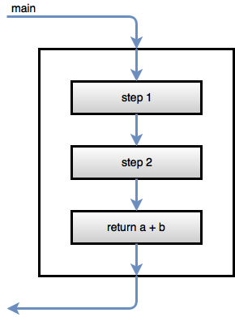
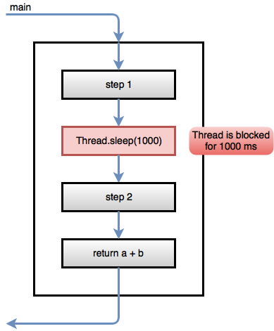
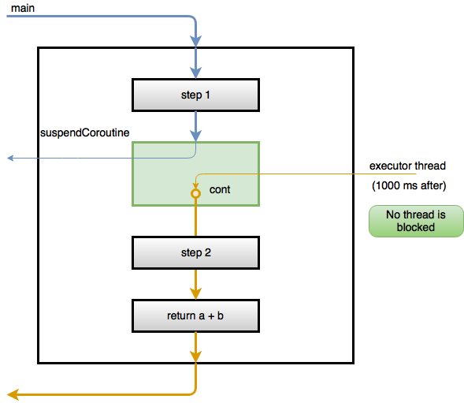
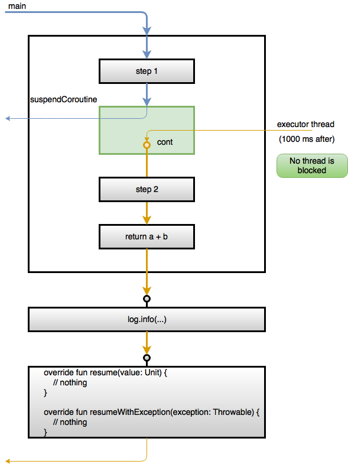

# An introduction to Kotlin Coroutines #

## Motivation ##

Asynchronous and concurrent programming plays an important role in the current world of Web APIs and microservices, where a significant part of our code is about orchestrating network interactions. 
Using traditional synchronous models, where threads are blocked while waiting for external responses, is not suitable for platforms where threads are costly, such as .NET or the JVM, or where there are special threads that can't be blocked, such as Javascript or Android applications.

There are various programming models to handle asynchronicity, ranging from simple callbacks to [reactive streams](http://www.reactive-streams.org) as a way to handle asynchronous sequences.
Among these, the concept of [*future*](https://en.wikipedia.org/wiki/Futures_and_promises) has seen broad adoption in multiple platforms (e.g. [Promises and thenables](https://developer.mozilla.org/en-US/docs/Web/JavaScript/Reference/Global_Objects/Promise) in javascript, [`CompletableFuture`](https://docs.oracle.com/javase/8/docs/api/java/util/concurrent/CompletableFuture.html) in Java 8, [`Task`](https://msdn.microsoft.com/en-us/library/dd321424(v=vs.110).aspx) in .NET), including language support via the async-await constructs, which are now available in languages such as C#, Javascript, and Python.
However, instead of also adding explicit async-await support in the Kotlin language, their designers decided to go a different route and addressed these problems using the different and more generic, although rather old, concept of coroutines.

This document provides a slow-paced introduction to Kotlin coroutines, as implemented via suspending functions, and their use to write asynchronous and concurrent programs.
Starting from the ground-up, we show how suspending functions allows us to turn callbacks into suspension points that don't break the apparent control flow.
From then we move to creating and starting coroutines as instances of these suspending functions, taking a look into the underlying state machine and continuation interfaces.
With this knowledge, we show how the async-await construct can be implemented as library functions without needing explicit language support.
We also show how to achieve interoperability with other JVM asynchronous constructs, converting between them and coroutines.

Kotlin coroutines are currently in experiment status, however their use is highly encouraged by the language designers and constitute a important mechanism for anyone programming connected systems.

## Coroutines and suspending functions ##

Let's start our journey into coroutines with a simple plain function that takes some parameters, performs two steps and returns a value.

```kotlin
fun simpleFunction(a: Int, b: Int): Int {
    log.info("step 1")
    log.info("step 2")
    return a + b
}
```

Calling this function from our `main` entry point function

```kotlin
fun main(args: Array<String>) {
    log.info("main started")
    log.info("result is {}", simpleFunction(40, 2))
    log.info("main ended")
}
```

produces the following log messages

```
8 [main] INFO intro - main started
9 [main] INFO intro - step 1
9 [main] INFO intro - step 2
10 [main] INFO intro - result is 42
10 [main] INFO intro - main ended
```

The value between brackets contains the names for the thread where the `log.info` calls were performed: in this example all were performed on the `main` thread (the one that calls the `main` method).
The following diagram illustrates the execution of `simpleFunction`, highlighting the fact that all statements are executed in same thread.



Now, suppose that between `step 1` and `step 2` we need to wait for something to happen, such as receiving a message from an external system or waiting for a time period to elapse.
To keep things simple lets illustrate that using a `Thread.sleep`

```kotlin
fun simpleFunctionWithDelay(a: Int, b: Int): Int {
    log.info("step 1")
    Thread.sleep(1000)
    log.info("step 2")
    return a + b
}
```

Running this function from our main method produces the following output

```
7 [main] INFO intro - main started
8 [main] INFO intro - step 1
1011 [main] INFO intro - step 2
1012 [main] INFO intro - result is 42
1012 [main] INFO intro - main ended
```

Again, all the statements are run on the `main` thread, which blocks for approximately 1000 ms between `step 1` and `step 2`.



However, blocking threads may not be a good thing:

* On client applications (e.g. Android applications), if the blocked thread is the GUI (Graphical User Interface) thread then the application will become unresponsive during the blocking period.

* On server applications, blocking threads will reduce the number of threads available to process new incoming requests and therefore reduce the system's throughput.

Kotlin **suspending** functions provide us with a way of handling these *pauses* in a sequential flow of statements without blocking the hosting thread. 
Namely, it allows a function 
* to suspend its execution, by returning immediately to its caller and "free up" the hosting thread.
* resume its execution in a future point in time, potentially on a different thread.

So, lets convert the previous `simpleFunctionWithDelay` example to a suspending function that does not block the hosting thread for the 1000 ms period, using suspending functions:

```kotlin
suspend fun suspendFunctionWithDelay(a: Int, b: Int): Int {
    log.info("step 1")
    suspendCoroutine<Unit> { cont ->
        executor.schedule(
          { cont.resume(Unit) }, 
          1000,TimeUnit.MILLISECONDS)
    }
    log.info("step 2")
    return a + b
}
```

The first thing to notice is that a suspending function declaration is prefixed with the `suspend` keywords.
However, the remaining function signature is unchanged: it still receives two integers and returns an integer.
As a comparison, in C#, an `async` function that asynchronously returns a `int` will have `Task<int>` as the return type and not `int`.  

Looking into the function body we notice that it remains mostly unchanged, except for the `Thread.sleep` call that was replaced by a call to `suspendCoroutine`.

This `suspendCoroutine` function, available in the `kotlin.coroutines.experimental` package, is used to *suspend* the function when it is invoked.
It has the following signature

```kotlin
public inline suspend fun <T> suspendCoroutine(crossinline block: (Continuation<T>) -> Unit): T
```

The main thing to understand is the `block` parameter, which is a function receiving a *continuation* representing the resume point after the suspension.
A continuation is an object implementing the following interface

```kotlin
public interface Continuation<in T> {
    /**
     * Resumes the execution of the corresponding coroutine passing [value] as the return value of the last suspension point.
     */
    public fun resume(value: T)

    /**
     * Resumes the execution of the corresponding coroutine so that the [exception] is re-thrown right after the
     * last suspension point.
     */
    public fun resumeWithException(exception: Throwable)

    /**
     * Context of the coroutine that corresponds to this continuation.
     */
    public val context: CoroutineContext
}
```

Ignoring the `context` field for the moment being, a `Continuation<T>` has two members: 
* the `resume` function, to be called if the suspending function should resume normally with a value; 
* and the `resumeWithException` function to be called if the suspending function should resume with an exception.

In our case, the continuation will _sort of reference_ the statement `log.info("step 2")`, i.e., the statement after the point where the function called `suspendCoroutine`.
It is the responsibility of the function invoking `suspendCoroutine` to pass a `block` that does something with that continuation.

In our case, we just we use a plain Java `ScheduledExecutorService` 
```kotlin
val executor = Executors.newScheduledThreadPool(1)
```

to schedule the execution of the continuation after 1000 ms.
```kotlin
suspendCoroutine<Unit> { cont ->
        executor.schedule(
          { cont.resume(Unit) }, 
          1000,TimeUnit.MILLISECONDS)
    }
```

The `{ cont.resume(Unit) }` is just the `Runnable` passed into the executor.

When the `main` thread enters the `suspendCoroutine` function, the passed in block will be called with the continuation and a callback will be scheduled on the executor.
After this, the `main` thread returns from the `suspendCoroutine` function and also from the `suspendCoroutine`.
Yes, that is right, the `main` thread does not continue to the `log.info("step 2")`
  
The following diagram illustrates the suspension and later resumption of the `suspendFunctionWithDelay`function.



The `main` thread enters the `suspendFunctionWithDelay`, executes the first step and then enters the `suspendCoroutine`, where the passed in `block` is immediately called, scheduling the `cont.resume(Unit)` to be run after 1000 ms.
After this, the `main` thread leaves the `suspendCoroutine` and, since this function is marked as suspend, it also leaves the `suspendFunctionWithDelay`.
That's right, the `main` thread does not continue to step 2. 
Instead the `suspendFunctionWithDelay` execution is suspended without blocking the `main` thread.

After the 1000 ms elapse, a thread from the scheduled pool (in orange color) calls `cont.resume(Unit)`, resuming the execution of the `suspendFunctionWithDelay`.
This suspension and resumption, including the switch between threads, is visible in the program output 

```
8 [main] INFO intro - main started
20 [main] INFO intro - step 1
24 [main] INFO intro - main ended
1027 [pool-1-thread-1] INFO intro - step 2
1029 [pool-1-thread-1] INFO intro - result is 42
```

Notice that the `main` function ends immediately after `step 1`, without waiting for the 1000 ms to elapse, because `suspendFunctionWithDelay` suspended its execution and *returns* to the `main` function.
After the 1000 ms elapses, the `suspendFunctionWithDelay` resumes its execution in the `pool-1-thread-1` (a thread from the scheduled pool) and `step 2` is executed.

Using `suspendCoroutine` directly in our `suspendFunctionWithDelay` makes the code a slightly brittle to read, namely due to the nested lambda passed as parameter.
However, that can be easily handled by wrapping that behavior on an helper suspending function

```kotlin
suspend fun delay(ms: Long) {
    suspendCoroutine<Unit> { continuation ->
        executor.schedule({ continuation.resume(Unit) }, ms, TimeUnit.MILLISECONDS)
    }
}
```

The `suspendFunctionWithDelay` now becomes
```kotlin
suspend fun suspendFunctionWithDelay2(a: Int, b: Int): Int {
    log.info("step 1")
    delay(1000)
    log.info("step 2")
    return a + b
}
```
which is as readable as our initial `simpleFunctionWithDelay` that used `Thread.sleep`, however has a non-blocking behavior.
In fact, the only thing different in `suspendFunctionWithDelay` is the fact that it is has the `suspend` modifier.
Every thing else is equal to the plain old `simpleFunctionWithDelay` blocking function, namely:
* No change in the function signature; it still returns a plain `Int`.
* No special keywords used in the function body.
However the `simpleFunctionWithDelay` exhibits the remarking behavior of 
* being after the `delay` call, freeing up the calling thread;
* resuming execution after 1000 ms on a *different* thread.

However, we are still missing an important part of the picture
Suspending functions can call regular functions or other suspending functions.
For instance, in the previous example the `suspendFunctionWithDelay` is a suspending function so it can call `delay` directly, which is also a suspending function.

However, suspending functions cannot be be called directly from regular functions.
Namely, our regular `main` function cannot call `suspendFunctionWithDelay` directly.
For that we need to use another function provided by the Kotlin library named `startCoroutine`, which is an regular (i.e. non-suspending) extension function over a `suspending lambda`.

```kotlin
public fun <T> (suspend  () -> T).startCoroutine(
        completion: Continuation<T>
)
```

The `startCoroutine` receives:
* the suspending lambda to start (as the extension target).
* the continuation to use when the suspending function completes its execution.

Using it we can create a simple `startAndForget` function
```kotlin
fun startAndForget(suspendingFunction: suspend () -> Unit) {
    suspendingFunction.startCoroutine(object : Continuation<Unit> {
        override fun resume(value: Unit) {
            // forget it
        }

        override fun resumeWithException(exception: Throwable) {
            // forget it
        }

        override val context: CoroutineContext
            get() = EmptyCoroutineContext
    })
}
```
that starts a suspending function and ignores its result.

We are now in condition to show the `main` function using the suspending version
```kotlin
fun main(args: Array<String>) {
    log.info("main started")
    startAndForget {
        log.info("result is {}", suspendFunctionWithDelay2(40, 2))
    }
    log.info("main ended")
}
```

which produces the output already shown before

```
8 [main] INFO intro - main started
20 [main] INFO intro - step 1
24 [main] INFO intro - main ended
1027 [pool-1-thread-1] INFO intro - step 2
1029 [pool-1-thread-1] INFO intro - result is 42
```

Notice how the `result is 42` log message appears in the `pool-1-thread-1`, after the `main` function is terminated.

The following diagram depicts the complete picture, including the `log.info` with the  `suspendFunctionWithDelay2` returned value, as well as the final continuation.


The continuation passed in to startCoroutine allow us to do more interesting things than just ignoring the result.
For instance, the following example uses a `CompletableFuture` to allow the `main` function to synchronize with the completable function termination.

```kotlin
fun startAndGetFuture(suspendingFunction: suspend () -> Unit): CompletableFuture<Unit>{
    val future = CompletableFuture<Unit>()
    suspendingFunction.startCoroutine(object : Continuation<Unit> {
        override fun resume(value: Unit) {
            future.complete(value)
        }

        override fun resumeWithException(exception: Throwable) {
            future.completeExceptionally(exception)
        }

        override val context: CoroutineContext
            get() = EmptyCoroutineContext
    })
    return future
}
```

With this, we can rewrite `main` to synchronize with the future completion.
We use a blocking `future.get()` but on a real scenario we could also use a non-blocking `future.thenApply`.

```kotlin
fun main(args: Array<String>) {
    log.info("main started")
    val future = startAndGetFuture {
        log.info("result is {}", suspendFunctionWithDelay2(40, 2))
    }
    future.get()
    executor.shutdown()
    log.info("main ended")
}
```

Running this `main` function produced

```
8 [main] INFO intro - main started
16 [main] INFO intro - step 1
1022 [pool-1-thread-1] INFO intro - step 2
1024 [pool-1-thread-1] INFO intro - result is 42
1025 [main] INFO intro - main ended
```

Notice how the `main` function only ends after the suspending function completely terminate (i.e. prints `result is 42`).

Until now, and based solely on this simple example, all this suspending mechanics may seem a rather complex way to achieve something that could be done using a simple callback.
However, the advantage of the coroutine mechanism starts to be apparent when the suspending functions is more than just an unconditional sequence of steps, such as the following example.

```kotlin
suspend fun suspendFunctionWithDelayAndALoopWithConditionalLogic(a: Int, b: Int): Int {
    for(i in 0..3) {
        log.info("step 1 of iteration $i")
        if(i % 2 == 0) {
            delay(1000)
        }
        log.info("step 2 of iteration $i")
    }
    return a + b
}
```

In this case, the produced output is

```
8 [main] INFO intro - main started
17 [main] INFO intro - step 1 of iteration 0
1024 [pool-1-thread-1] INFO intro - step 2 of iteration 0
1024 [pool-1-thread-1] INFO intro - step 1 of iteration 1
1024 [pool-1-thread-1] INFO intro - step 2 of iteration 1
1024 [pool-1-thread-1] INFO intro - step 1 of iteration 2
2028 [pool-1-thread-1] INFO intro - step 2 of iteration 2
2028 [pool-1-thread-1] INFO intro - step 1 of iteration 3
2028 [pool-1-thread-1] INFO intro - step 2 of iteration 3
2031 [pool-1-thread-1] INFO intro - result is 42
2032 [main] INFO intro - main ended
```

