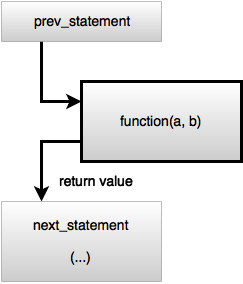
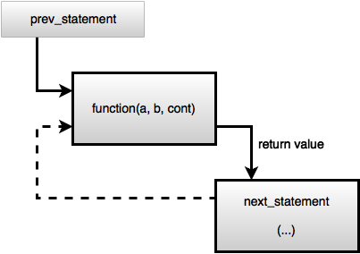

# Suspending functions, coroutines and state machines #

We started this guide referring that Kotlin uses coroutines to address asynchronicy issues, however the mechanism presented in the previous section is called *suspending functions*.
So, what is the relation between these *suspending functions* and coroutines? 
And how is it possible for a thread to leave a suspending function while in the middle of it, without a return in sight.

A look into how suspending functions are compiled provides the necessary knowledge to answer these questions.

First, the generated code has a different signature from the one exhibited by the suspending function.
Instead of,
```kotlin
suspend fun suspendFunctionWithDelay(a: Int, b: Int): Int
```

the generated code has the following Java-equivalent signature.

```java
public static final Object suspendFunctionWithDelay(int a, int b, @NotNull Continuation var2) {
```

The first thing to notice is that a third parameter, of type `Continuation`, is added to the parameter list.
We already saw the signature for this `Continuation`

```kotlin
public interface Continuation<in T> {
    public fun resume(value: T)
    public fun resumeWithException(exception: Throwable)
    (...)
}
```

This continuation will be used to pass the code present in the source code after `suspendFunction`.
Why is this required?
Mainly because the `suspendFunction` will return on the first suspension point, before having fully completed.
The code after `suspendFunction` can only be executed after this function fully completes, which potentially happens in a different thread.

# !alternative

We started this guide referring that Kotlin uses coroutines to address asynchronicy issues, however the mechanism presented in the previous section is called *suspending functions*.
So, what is the relation between these *suspending functions* and coroutines? 
And how is it possible for a thread to leave a suspending function while in the middle of it, without a return in sight.
A look into how suspending functions are compiled provides the necessary knowledge to answer these questions.

The code generated by the Kotlin compiler for suspending functions uses a method named [*continuation passing style*](https://en.wikipedia.org/wiki/Continuation-passing_style).
On the normal *direct style,* when a function ends it returns to its call site, typically be assigning the program counter with the value saved in the stack.  
On the continuation-passing style, the code to execute after a function ends is passed in to the function as an extra parameter, called the *continuation*

For instance, consider the following pseudo-code

```
prev_statement
function(a,b)
next_statement
...
````

Using a direct passing style, the call can be represented with the following diagram



Using the continuation-passing style, the code after the `function` call is encapsulated in a function, which is passed in the call to `function`.



As an example, the generated code for the following suspending function.
Instead of,
```kotlin
suspend fun suspendFunctionWithDelay(a: Int, b: Int): Int
```

has the following Java-equivalent signature.

```java
public static final Object suspendFunctionWithDelay(int a, int b, @NotNull Continuation var2) {
```

where `Continuation` is an interface with the following signature

```kotlin
public interface Continuation<in T> {
    public fun resume(value: T)
    public fun resumeWithException(exception: Throwable)
    (...)
}
```

Note that this is the same `Continuation` interface used in the `suspendCoroutine` described in the previous section.


